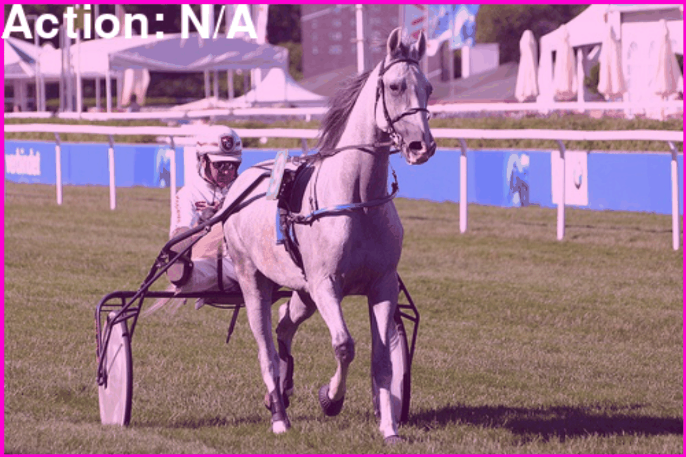
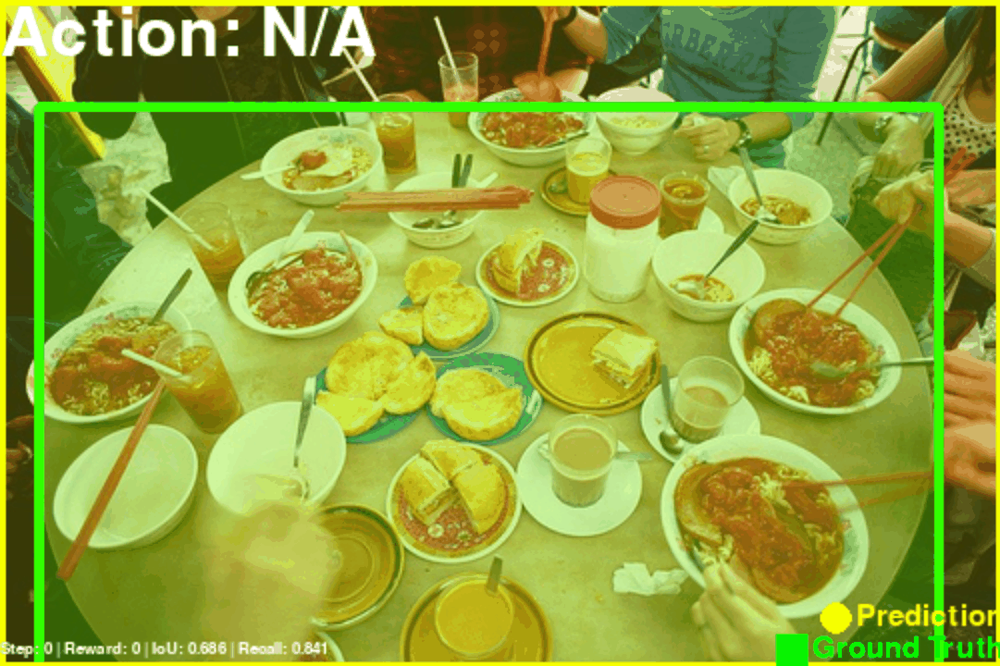
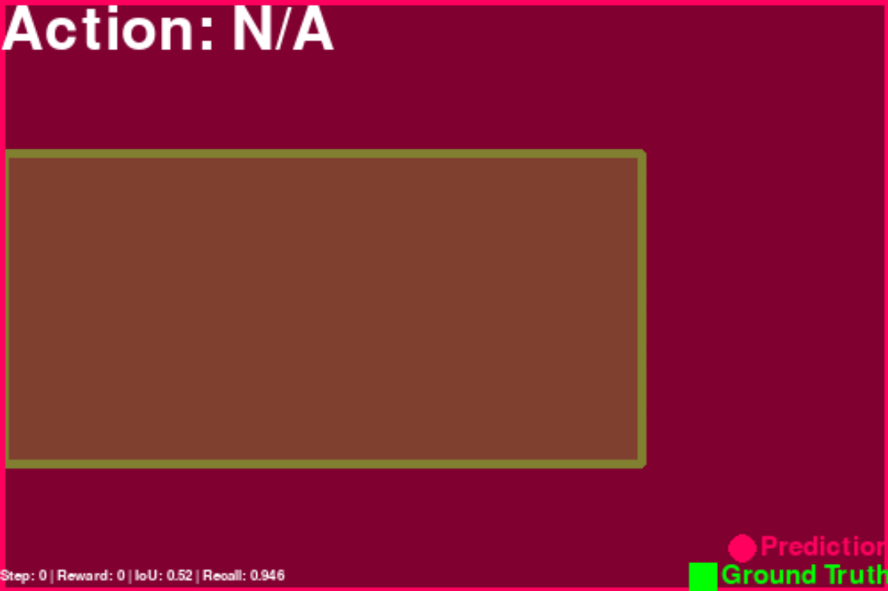
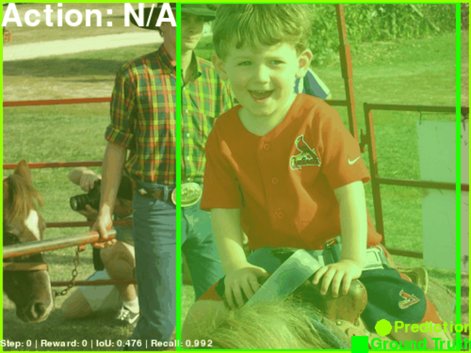
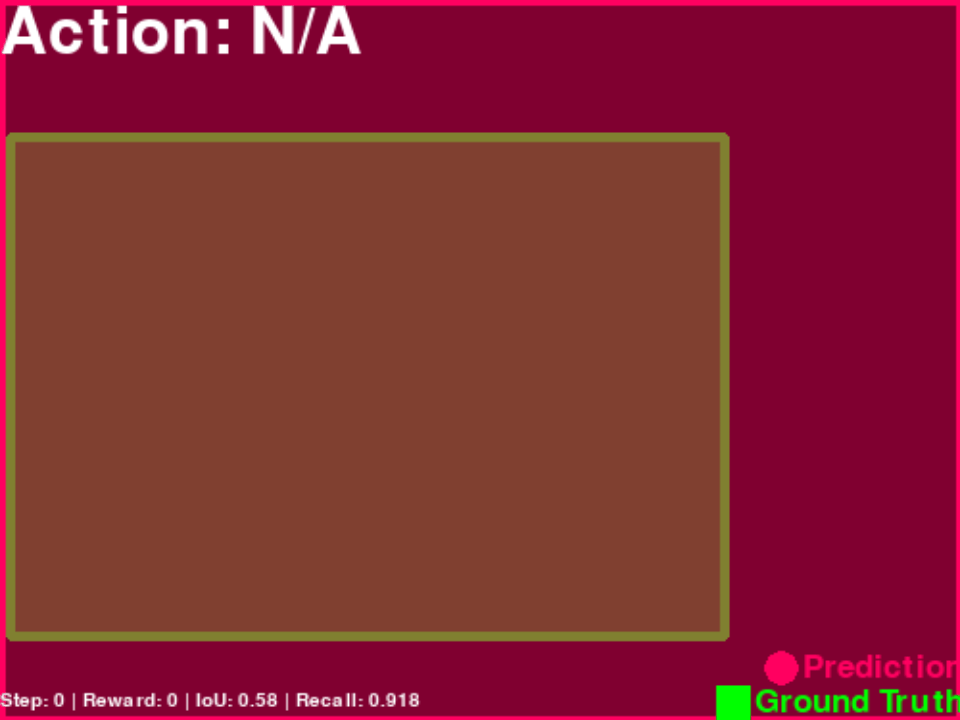
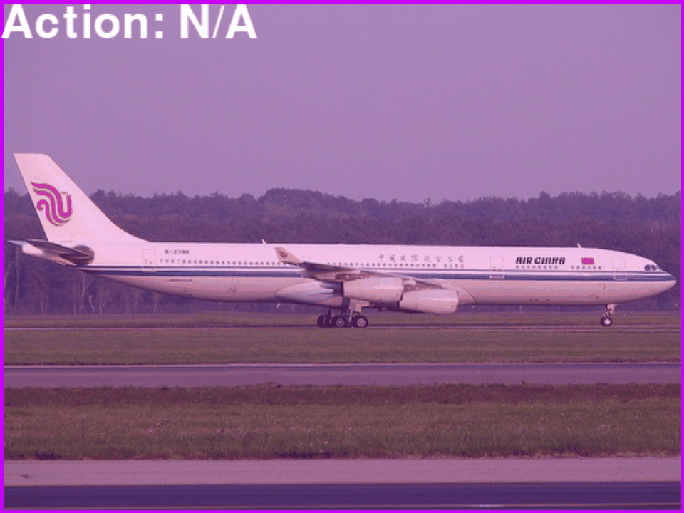
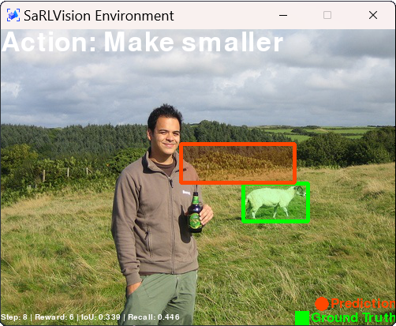
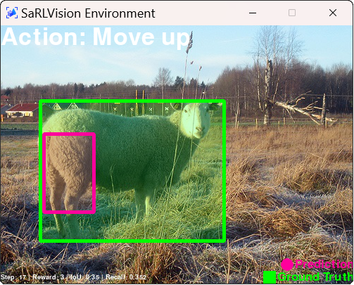
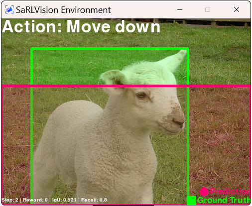
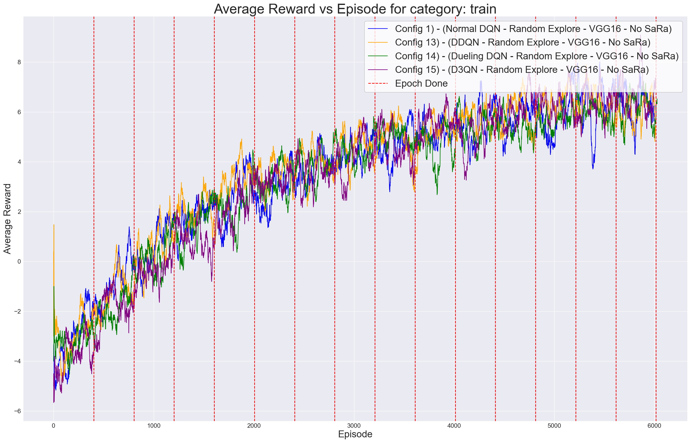

# SaRLVision

<p align="right" style="text-align: right;">
  <strong>"A reinforcement learning object detector which leverages saliency ranking."</strong>
</p>
<br>
<p align="left" style="text-align: left;">
  <strong>"A self-explainable detector that provides a fully observable action log."</strong>
</p>

<p align='center'>
<table align="center">
  <tr>
    <td align="center">
      
    </td>
    <td align="center">
      
    </td>
    <td align="center">
      
    </td>
  </tr>
  <tr>
    <td align="center">
      
    </td>
    <td align="center">
      
    </td>
    <td align="center">
      
    </td>
  </tr>
  <tr>
    <td align="center">
      
    </td>
    <td align="center">
      
    </td>
    <td align="center">
      
    </td>
  </tr>
  <tr>
    <td align="center">
      
    </td>
    <td align="center">
      
    </td>
    <td align="center">
      
    </td>
  </tr>
</table>
</p>

<p align="justify">

## Abstract
*In an era where sustainability, and transparency are paramount, the importance of effective object detection algorithms cannot be overstated. While these algorithms are notably fast, they lack transparency in their decision-making process. This study explores a series of experiments on object detection, which combine reinforcement learning-based visual attention methods with saliency ranking techniques, in an effort to investigate transparent and sustainable solutions. By employing saliency ranking techniques that emulate human visual perception, the reinforcement learning agent is provided with an initial bounding box prediction. Given this preliminary estimate, the agent iteratively refines these bounding box predictions by selecting from a finite set of actions over multiple time steps, ultimately achieving accurate object detection. This research also investigates the use of various image feature extraction methods, in addition to exploring various Deep Q-Network (DQN) architectural variations for deep reinforcement learning-based localisation agent training. Additionally, it focuses on optimising the pipeline at every juncture by prioritising lightweight and faster models. Furthermore, the designed system also allows for the classification of detected objects, a capability absent in previous reinforcement learning approaches. After evaluating the performance of these agents using the Pascal VOC 2007 dataset, faster and more optimised models were developed. Notably, the best mean Average Precision (mAP) achieved in this study was 51.4, surpassing benchmarks from RL-based single object detectors present in the literature. Compared to previous methods, the designed system also includes multiple configurable real-time visualisations. These visualisations offer users a clear view of the current bounding boxes coordinates and the types of actions being performed, both of which enable a more intuitive understanding of algorithmic decisions. Ultimately, fostering trust and transparency in object detection systems, aiding in the deployment of artificial intelligence techniques in high-risk areas, while continuously advancing research in the field of AI.*

## System Overview

<p align="justify">

Initially, the system proceeds to generate a saliency ranking heatmap using the input image, emphasising regions of interest. It then takes the most important ranks to create an initial bounding box prediction, which is a key stage in object localisation. This prediction is then fed to the RL environment, where an agent navigates through a series of time steps, repeatedly completing actions to improve the bounding box and precisely pinpointing the object within an image, while also predicting the object class label.
</p>

<p align='center'>
  
</p>

## Saliency Ranking

<p align='justify'>

The initial process in the development of the system involves the utilisation of saliency ranking to derive an initial bounding box estimate. Alternatively, users may choose not to employ this technique, resulting in the initial bounding box covering the entirety of the input image, a practice commonly observed in existing literature. Following the acquisition of the Saliency Ranking heatmap from [SaRa](https://github.com/dylanseychell/SaliencyRanking), the first stage of this process entails the extraction of a bounding box that delineates the pertinent image segments. This technique considers a proportion of the highest-ranked areas, with a fixed threshold of 30% and number of iterations set to 1. The generation of these initial bounding boxes is critical due to the fact that it allows for the separation and delineation of prominent regions in the image for further refining utilising RL techniques.
</p>

<p align='center'>
  
</p>

## Reinforcement Learning

<p align="justify">

In the subsequent phase of the devised pipeline, reinforcement learning is harnessed to accomplish object localisation within the images. To this extent the developed system was built via the [gymnasium](https://gymnasium.farama.org/index.html) API, which facilitated the formulation of the problem as a Markov Decision Process (MDP), inspired from the existing literature. Subsequently, Deep Reinforcement Learning (DRL) techniques were applied to approximate the object detection problem.
</p>

### Action Space

<p align="justify">

Similar to methodologies commonly employed in object localisation tasks, the action set $A$ consists of eight transformations that can be applied to the bounding box, along with one action designated to terminate the search process. These transformations are grouped into four subsets: horizontal and vertical box movement, scale adjustment, and aspect ratio modification. Consequently, the agent has four degrees of freedom to adjust the bounding box $[x_1, y_1, x_2, y_2]$ during interactions with the environment. Additionally, a trigger action is incorporated to indicate successful object localisation by the current box, thereby concluding the ongoing search sequence, and drawing an IoR marker on the detected object.
</p>

<p align='center'>
  
</p>

### Deep Q-Network Architecture

<p align="justify">

The DQN architecture, introduced in the presented system, assumes responsibility for decision-making in object localisation. To this extent, the designed architecture draws inspiration from methodologies present in the prevalent literature. Our proposed approach, introduces four DQN variants:
1. `Vanilla DQN (DQN)`
2. `Double DQN (DDQN)`
3. `Dueling DQN (Dueling DQN)`
4. `Double Dueling DQN (D3QN)`

Our approach advocates for a deeper DQN network to bolster decision-making capabilities and enhance learning complexity. To mitigate concerns regarding overfitting, dropout layers are seamlessly integrated into the network architecture. Additionally, this work develops a Dueling DQN Agent to improve learning efficiency by decoupling state and advantage functions. The Dueling DQN design divides the $Q$-value function into two streams, allowing the agent to better comprehend the value of doing specific actions in different situations. The proposed approach also evaluates DDQN and D3QN techniques, which have also not been previously examined, in pursuit of achieving better results.
</p>

<p align='center'>
  
</p>

### Self-Explainability

<p align="justify">
The study proposes a system that creates a log and displays the current environment in several rendering modes to illustrate explainability, as demonstrated below:

<p align='center'>
  
</p>

These visualisations provide users with insights into the current action being performed, the current IoU, the current Recall, the environment step counter, the current reward, and a clear view of the current bounding box and ground truth bounding box locations in the original image. Furthermore, unlike all object detectors and methodologies previously discussed, this methodology permits decision-making observation during the training phase, albeit there is a slight time overhead for the creation of visualisations. 
Nonetheless, the system provides a clear log outlining the framework's decision-making process for current item detection, allowing insight into the object detector's training and assessment, as observed below:

<p align='center'>
  
</p>

</p>

## SaRLVision Window

<p align="justify">

The SaRLVision Window provides a real-time view of the object detection process, displaying the current state of the environment, the actions being taken, and the corresponding results. This interactive window is designed to be user-friendly, providing a clear and intuitive interface for users to understand the workings of the system.

<p align='center'>
<table align="center">
  <tr>
    <td align="center">
      
    </td>
    <td align="center">
      
    </td>
    <td align="center">
      
    </td>
  </tr>
</table>
</p>

This window is implemented using the `pygame` library, which is a popular framework for building interactive applications and games in Python. Pygame provides a set of functions and classes for creating graphical user interfaces, handling user input, and rendering graphics on the screen. By utilizing the Pygame API, the SaRLVision Window is able to provide a visually appealing interface to users.

</p>

## Evaluation

<p align="justify">

The designed SaRLVision system was extensively tested for a number of environment configurations with the aforementioned agents across a set of experiments. The system was evaluated through the `mean Average Precision (mAP)` metric, which is a widely used metric for evaluating object detection models. The mAP metric is calculated by averaging the precision-recall curve for each class, and then averaging the results across all classes. This metric provides a comprehensive evaluation of the model's performance, taking into account both precision and recall. Furthermore, the developed agents where trained on the `Pascal VOC 2007+2012 training` set and evaluated on the `Pascal VOC 2007 test` set, which is a standard benchmark dataset for object detection, as prevalent in the literature. The results showcasing different agents and different environment configurations are presented below:

<p align='center'>
  
</p>

<!-- | **Index** | **aero** | **bike** | **bird** | **boat** | **bottle** | **bus** | **car** | **cat** | **chair** | **cow** | **table** | **dog** | **horse** | **mbike** | **person** | **plant** | **sheep** | **sofa** | **train** | **tv** | **mAP** |
|---|---|---|---|---|---|---|---|---|---|---|---|---|---|---|---|---|---|---|---|---|---|
| **Config 1) (Ours)** | 76.4 | 25.7 | 64.3 | 18.3 | 4.1 | **74.6** | **67.9** | 73.1 | 4.1 | 64.3 | 34.1 | 29.8 | **82.7** | 73.9 | 38.8 | 6.6 | 68.9 | 21.3 | 52.9 | 55.7 | 46.9 |
| **Config 2) (Ours)** | 60.2 | 14.0 | 13.5 | 60.0 | 4.3 | 70.1 | 60.1 | 68.7 | 15.3 | 12.7 | 65.1 | 18.4 | 64.3 | 21.0 | 67.8 | **65.2** | 69.2 | 20.9 | 12.5 | 1.2 | 39.2 |
| **Config 3) (Ours)** | 70.8 | 30.3 | **72.1** | 17.7 | 19.9 | 49.3 | 63.9 | 66.9 | 6.2 | 21.6 | 33.4 | **66.0** | 70.1 | 72.6 | 22.4 | 7.2 | 44.4 | 21.5 | **72.1** | 14.1 | 42.1 |
| **Config 4) (Ours)** | 74.0 | 65.2 | 22.6 | 9.2 | 6.7 | 35.3 | 30.0 | 34.4 | 1.2 | 22.6 | 67.9 | 25.2 | 69.2 | 32.5 | 20.8 | 58.9 | **70.0** | 23.1 | 42.9 | 2.7 | 35.7 |
| **Config 5) (Ours)** | 65.5 | 17.8 | **67.8** | 11.3 | 2.2 | 39.1 | 64.5 | 64.8 | **65.6** | 26.5 | 66.9 | 62.0 | **74.8** | 32.0 | 22.5 | 5.0 | 16.4 | 21.6 | 71.9 | 3.8 | 40.1 |
| **Config 6) (Ours)** | 27.6 | 26.2 | 20.0 | 12.8 | **58.6** | **72.4** | 62.1 | 59.1 | 59.1 | 14.8 | 62.5 | 60.7 | 60.7 | 18.6 | **68.8** | 1.7 | 13.8 | 59.1 | 69.7 | 2.6 | 41.5 |
| **Config 7) (Ours)** | 74.3 | 18.8 | 21.3 | 17.7 | 1.9 | 25.7 | 66.4 | 24.3 | 4.3 | 64.8 | **71.9** | 30.1 | 30.6 | 62.3 | 22.1 | 1.8 | 12.5 | 25.3 | 73.7 | 3.9 | 32.7 |
| **Config 8) (Ours)** | **76.8** | 16.2 | 33.2 | 18.0 | 25.2 | 31.8 | 23.2 | 64.7 | 4.9 | 22.2 | 34.5 | 39.5 | **74.1** | 23.3 | 61.5 | 6.8 | 20.2 | 25.1 | 69.8 | 2.9 | 33.7 |
| **Config 9) (Ours)** | 56.2 | 23.6 | 45.6 | 26.5 | 3.5 | 68.6 | **67.0** | 33.7 | 4.3 | 17.5 | 68.2 | 45.1 | **76.2** | 45.2 | 20.4 | 4.8 | **66.3** | **63.9** | **76.5** | 15.4 | 41.4 |
| **Config 10) (Ours)** | 72.6 | **62.6** | 22.0 | 18.4 | **65.1** | 33.6 | **65.2** | 44.9 | 15.4 | **65.7** | 28.2 | 63.4 | 70.1 | 30.5 | 11.2 | 10.0 | 64.9 | 18.2 | 68.0 | **64.3** | 44.7 |
| **Config 11) (Ours)** | 74.4 | 27.6 | 35.6 | **61.5** | 14.7 | 34.2 | **64.2** | 43.9 | 4.7 | 62.8 | 73.4 | 24.8 | **81.1** | **71.8** | 16.2 | 5.3 | 22.5 | 65.4 | **76.3** | 2.9 | 43.2 |
| **Config 12) (Ours)** | **70.6** | 19.2 | 60.2 | 30.1 | 2.4 | 37.8 | 23.6 | **75.2** | 3.2 | 61.2 | 63.3 | 37.5 | 21.6 | 22.2 | 9.1 | 4.0 | 29.6 | 63.8 | 67.8 | 1.9 | 35.2 |
| **Config 13) (Ours)** | 64.0 | 26.5 | 20.9 | 20.7 | 7.4 | 40.8 | 48.7 | 71.5 | 4.2 | 36.3 | 25.7 | **66.0** | **80.5** | 38.1 | 25.1 | 15.0 | 63.8 | 65.2 | 73.8 | 4.4 | 39.9 |
| **Config 14) (Ours)** | 76.4 | 62.0 | 46.9 | 62.2 | 3.1 | 69.6 | 36.6 | 66.8 | 4.0 | 29.6 | 64.1 | 23.4 | 78.1 | **75.3** | 31.2 | 62.6 | 69.6 | 33.9 | 68.7 | 14.9 | 49.0 |
| **Config 15) (Ours)** | 76.0 | **74.2** | 67.1 | **64.7** | 4.7 | 72.7 | 64.5 | 68.7 | 3.6 | 33.7 | 23.4 | 34.0 | 77.2 | 71.5 | 64.9 | 3.2 | 23.1 | **67.5** | 73.6 | 59.3 | **51.4** |
|---|---|---|---|---|---|---|---|---|---|---|---|---|---|---|---|---|---|---|---|---|---|
| **Best Category APs (Ours)** | **76.8** | **74.2** | **72.1** | **64.7** | **65.1** | **74.6** | **67.9** | **75.2** | **65.6** | **65.7** | **73.4** | **66.0** | **82.7** | **75.3** | **68.8** | **65.2** | **70.0** | **67.5** | **76.5** | **64.3** | **70.6** | -->

</p>

## A Demonstration

<p align="justify">

Need a visual demonstration of the system in action? Check out the following video:
<center>

<a href="https://www.youtube.com/watch?v=S8gUYhOAAkE">https://www.youtube.com/watch?v=S8gUYhOAAkE</a>

</center>
</p>

## Getting Started

<p align="justify">

The following jupyter notebooks are provided to demonstrate the functionality of the system:
- [Dataset Notebooks](https://github.com/mbar0075/SaRLVision/tree/main/Experiments/Datasets)
- [Saliency Ranking Threshold Experiments](https://github.com/mbar0075/SaRLVision/tree/main/Experiments/Threshold%20Experiments)
- [Training.ipynb](https://github.com/mbar0075/SaRLVision/tree/main/Experiments/RL%20Agent%20Training/Training.ipynb)
- [Evaluation.ipynb](https://github.com/mbar0075/SaRLVision/tree/main/Experiments/RL%20Agent%20Training/Evaluation.ipynb)
- [Testing.ipynb](https://github.com/mbar0075/SaRLVision/tree/main/Experiments/RL%20Agent%20Training/Testing.ipynb)
- [Visualisations.ipynb](https://github.com/mbar0075/SaRLVision/tree/main/Experiments/RL%20Agent%20Training/Visualisations.ipynb)
- [Self-Explainability.ipynb](https://github.com/mbar0075/SaRLVision/tree/main/Experiments/RL%20Agent%20Training/Self-Explainability.ipynb)
- [Plotting Results.ipynb](https://github.com/mbar0075/SaRLVision/tree/main/Experiments/RL%20Agent%20Training/Plotting_Results.ipynb) 
- [Generate-GIFs.ipynb](https://github.com/mbar0075/SaRLVision/tree/main/Experiments/RL%20Agent%20Training/Generate-GIFs.ipynb) 
  
</p>


## Installation
To get started, clone the repository and navigate to it:
```bash
git clone https://github.com/mbar0075/SaRLVision.git
cd SaRLVision
```

You can also clone the environment used for this project using the `environment.yml` file provided in the `Requirements` directory. To do so, you will need to have Anaconda installed on your machine. If you don't have Anaconda installed, you can download it from [here](https://www.anaconda.com/products/distribution). Once you have Anaconda installed, you can run the following commands to install the environment and activate it

To install the environment, run the following command:
```bash
cd Requirements
conda env create -f environment.yml
conda activate SaRLVision
```

Alternatively you can create the environment manually by running the following commands and install the packages in the `requirements.txt` file in the `Requirements` directory:
```bash
cd Requirements
conda create --name SaRLVision python=3.9.16
conda activate SaRLVision
pip install -r requirements.txt
```

In case you want to install the packages manually, you can do so by running the following commands:
<details>
<summary  style="color: lightblue; cursor: pointer"><i> pip install . . .</i></summary>

```bash
pip install notebook
conda install swig
conda install nomkl
pip install opencv-python
pip install gymnasium[all]
pip install ufal.pybox2d
pip install pygame
pip install renderlab
pip install numpy
pip install matplotlib
pip install pandas
pip install seaborn
pip install scikit-learn
pip install pycotools

# Installing pytorch with CUDA 11.8
pip install torch torchvision torchaudio --index-url https://download.pytorch.org/whl/cu118/torch_stable.html

# Installing tensorflow with CUDA 11.2
conda install -c conda-forge cudatoolkit=11.2 cudnn=8.1.0
# Anything above 2.10 is not supported on the GPU on Windows Native
python -m pip install "tensorflow<2.11"
# Verify the installation:
python -c "import tensorflow as tf; print(tf.config.list_physical_devices('GPU'))"
```

In case of any further issues, you can install `cuda` from the following links: [NVIDIA CUDA Toolkit](https://developer.nvidia.com/cuda-toolkit-archive),
[Windows 11.8](https://developer.nvidia.com/cuda-11-8-0-download-archive?target_os=Windows&target_arch=x86_64&target_version=11&target_type=exe_local),
and install the corresponding `pytorch` and `tensorflow` versions from the following links: [PyTorch](https://pytorch.org/get-started/locally/), [TensorFlow](https://www.tensorflow.org/install/pip), respectively.
</details>

</p>